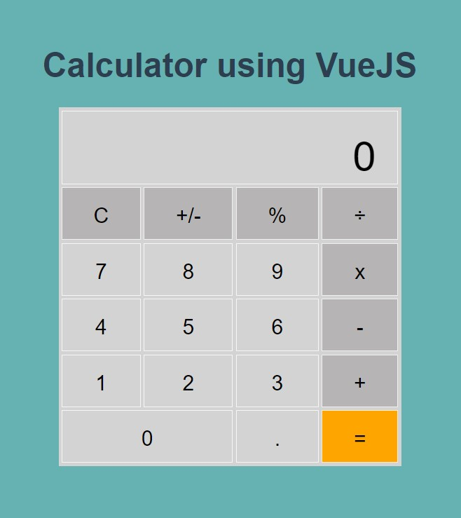

# Calculator using VueJS
I created this calculator project for me to familiarize in using VueJS and to apply what I learned by watching tutorials in VueJS. I am currently following a Junior Web Developer training at Becode. I worked on this project on May 12 - 13, 2021

Note: I am using VueJS version 2

- I can create a Vue project using **Vue CLI**
- I can deploy my vue project in Github pages. I followed this article in [dev.to](https://dev.to/rolanddoda/deploy-to-github-pages-like-a-pro-with-github-actions-4hdg).
- Limit to 8 decimal places
- Updated this project on May 26-27, 2021.

## Website
[https://frances-joffany-navarro.github.io/calculator-vuejs/](https://frances-joffany-navarro.github.io/calculator-vuejs/)

## Preview

## Credit
- [15 VUE JS Project Ideas: Beginner to Expert [With tutorial]](https://nerdjfpb.medium.com/15-vue-js-project-ideas-beginner-to-expert-with-tutorial-9a315d184a91).
- This is a helpful site https://vuejs.org/. There are also free video tutorials website linked on this site.